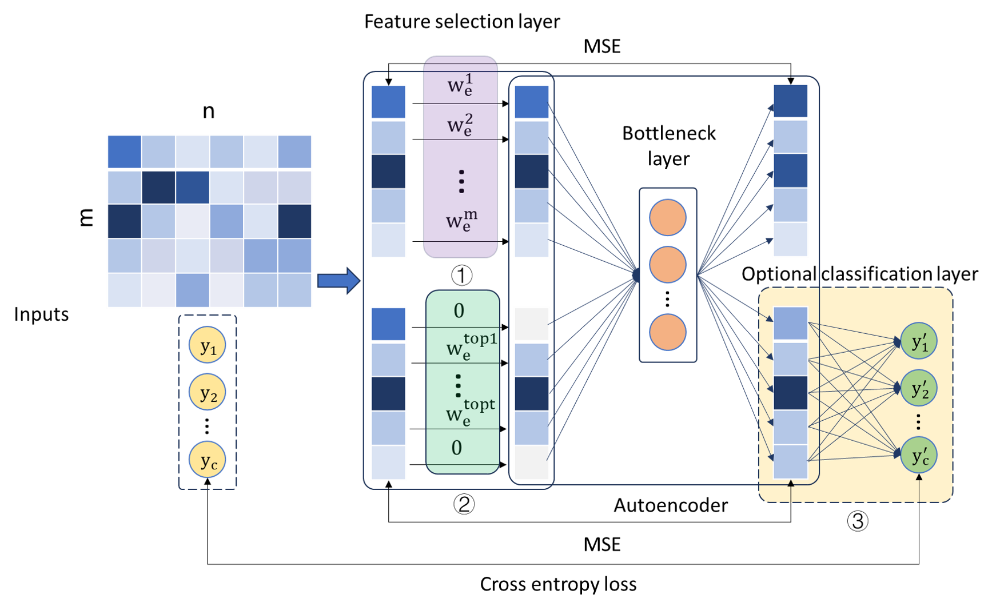

# RFAE
> The primary objective of feature selection is to consistently identify an optimal feature subset that either faithfully represents the entire dataset or demonstrates superior performance in downstream tasks. Presently, deep learning-based feature selectors frequently exhibit inadequate robustness. As a remedy, this endeavor incorporates a dual-pathway mechanism for comprehensive feature selection optimization and local redundancy elimination and culminates in the creation of a high-robust feature selector, referred to as Robust Fractal Autoencoders (RFAE). This innovative approach encompasses three pivotal enhancements: 1) Novel utilization of weight exponentiation to rectify the concern of FAE selecting a reduced number of features than designated. 2) Adoption of a dynamic and tailored strategy to optimize feature selection weights during the training process. 3) Introduction of a optional classification module, facilitating extension to supervised feature selection scenarios. We conducted experiments on a synthetic dataset, GEO gene dataset, and 14 common datasets to demonstrate the effectiveness of our method.

You can access the experiments conducted in the paper by following [here](https://github.com/jingfengou/RFAE/tree/main/Experiments).

## Model

<div align="center">
     
</div>

### Dynamic windows

<div align="center">
     
</div>


## Usage
The version information in use: Python 3.8.16, Pytorch 2.0.1, Tensorflow 2.12.0.

You can use RFAE to select key features from the data you input, where you can set the desired number of features.
```sh
p_epochs_number = 1000
p_batch_size_value = 128

device = get_free_gpu()
p_key_feature_number = 50
p_seed = 0
#   Parameter settings

file_path = "./Data/mnist.npz"      # File path, location to store the data
datasetname = "MNIST"


dataset = np.load(file_path)
x_train_, y_train_ = dataset['x_train'], dataset['y_train']
x_test_, y_test_ = dataset['x_test'], dataset['y_test']
x_data = np.r_[x_train_, x_test_].reshape(70000, 28 * 28).astype('float32') / 255.0
y_data = np.r_[y_train_, y_test_]
#    read data

clf = True

clf_feature_list = model.cal(x_data, y_data, datasetname, p_key_feature_number, p_epochs_number, p_batch_size_value, clf, p_seed, device)
```

We illustrated the specific usage of our method using the MNIST dataset as an example. You can find the details [here](https://github.com/jingfengou/RFAE/tree/main/Examples).


## Release History
* 0.0.3
    * CHANGE: Update README.md 
    
* 0.0.2
    * ADD: Create LICENSE

* 0.0.1
    * ADD: Model, Examples, and Experiments


## Contacts

Jingfeng Ou – jf.ou@siat.ac.cn

Distributed under the MIT license. See [``LICENSE``](https://github.com/jingfengou/RFAE/blob/main/LICENSE) for more information.
